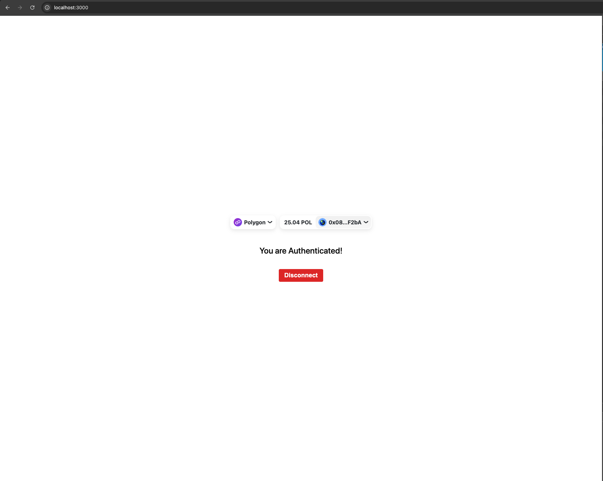

# 🦊 Wallet Auth DApp

A full-stack authentication system using **Ethereum Wallet Sign-In**, built with **Next.js (App Router)**, **RainbowKit**, **Wagmi**, **Viem**, **Redis**, and **JWT**. Users authenticate by signing a nonce message with their wallet (e.g., MetaMask), and receive a secure cookie-based session.

---

## ✨ Features

- 🔐 Wallet-based authentication (Sign-In with Ethereum)
- 📦 Secure token handling using HTTP-only cookies
- 🔁 Access & Refresh token strategy with Redis-backed refresh token storage
- ⚡ Built with App Router (`app/`) and API routes (`pages/api/`)
- 🧠 Stateless JWT-based session management
- 🧰 Redis for nonce and token store
- 🐳 Docker support for easy containerized deployment
- 📱 Styled with RainbowKit’s ConnectButton

---

## 🚀 Tech Stack

- **Next.js** (App Router + API Routes)
- **TypeScript**
- **Wagmi + Viem + RainbowKit**
- **JWT (jsonwebtoken)**
- **Redis (ioredis)**
- **Node.js 20+**
- **Docker**

---

## 🔐 Authentication Flow

1. **Connect Wallet** using RainbowKit.
2. **Request Nonce** via `/api/nonce` (stored in Redis).
3. **User signs nonce** with wallet (via Viem).
4. **Backend verifies signature** and issues:
   - `auth_token` (JWT, short-lived, HTTP-only cookie)
   - `refresh_token` (JWT, stored in Redis)
5. **Refresh endpoint** issues new `auth_token` if `refresh_token` is valid.
6. **Logout** clears cookies and Redis token.

---

## 📦 Installation

```bash
git clone https://github.com/ErfunEb/wallet-auth-dapp.git
cd wallet-auth-dapp

# Install dependencies
yarn install

# Add Redis and JWT secrets to `.env`
cp .env.example .env
```

---

## 🔧 .env

```env
REDIS_URL=redis://localhost:6379
JWT_SECRET=supersecretkey
JWT_REFRESH_SECRET=refreshsupersecret
AUTH_TOKEN_DURATION=15m
REFRESH_TOKEN_DURATION=7d
NODE_ENV=development
```

---

## 🐳 Docker Setup

```bash

# Build the container
docker build -t wallet-auth-dapp .

# Run with Redis
docker run --name wallet-auth -p 3000:3000 wallet-auth-dapp

# Build and run the app with Redis using Docker Compose
docker-compose up --build

```

_Optional: use `docker-compose` for Redis and app together._

---

## 🧪 API Routes

| Method | Route           | Description                    |
|--------|------------------|--------------------------------|
| POST   | `/api/nonce`     | Generate a nonce               |
| POST   | `/api/verify`    | Verify wallet signature        |
| GET    | `/api/me`        | Return user from access token  |
| POST   | `/api/refresh`   | Refresh the auth_token         |
| POST   | `/api/logout`    | Invalidate session             |

---

## 📸 Screenshots



---

## 💼 Ideal For

- Web3 authentication proof-of-concept
- DApps that require wallet login without storing private keys
- Secure cookie-based auth flow for Ethereum users

---

## 📃 License

MIT License

---

## 👨‍💻 Author

Made with ❤️ by [@ErfunEb](https://github.com/ErfunEb)
